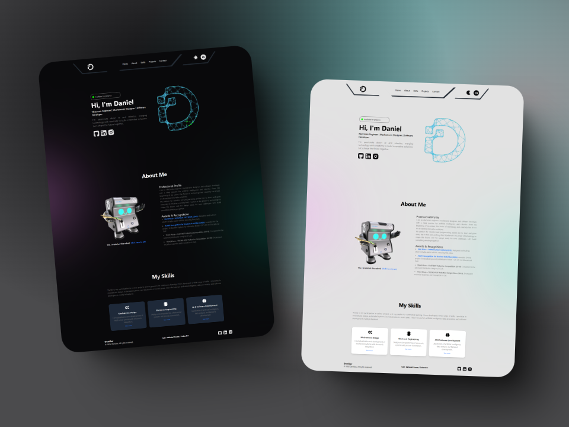

# 🚀 Portafolio - React + Vite  

Este es un **portafolio web** desarrollado con **React** y **Vite**, utilizando **Tailwind CSS** para el diseño.  

## 🌟 Vista previa  
  

## 🛠️ Tecnologías utilizadas  
- ⚛️ **React** - Librería para la construcción de interfaces de usuario.  
- ⚡ **Vite** - Entorno de desarrollo rápido y optimizado.  
- 🎨 **Tailwind CSS** - Framework de utilidades para el diseño estilizado.  

## 🚀 Instalación y ejecución  
Si deseas ejecutar este proyecto en tu máquina local, sigue estos pasos:  


1️⃣ **Clona el repositorio:**  
```bash
git clone https://github.com/DanielCaicedo97/danidev.git

```

2️⃣ Instala las dependencias:

```bash
npm install
```

3️⃣ Ejecuta el proyecto en modo desarrollo:
```bash
npm run dev
```
o

```bash
npm start
```
📌 Descripción
Este portafolio web muestra mis habilidades, proyectos y experiencia en el desarrollo de software. Puedes explorar mis habilidades en desarrollo web, inteligencia artificial, electrónica y automatización.

¡Siéntete libre de explorar y contribuir! 😃🔥